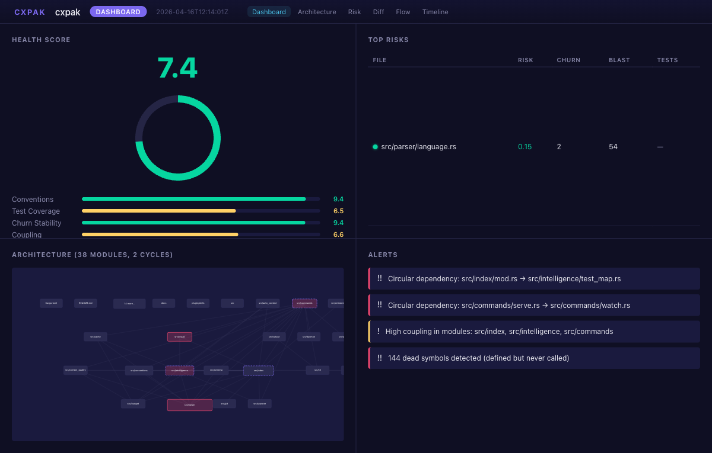
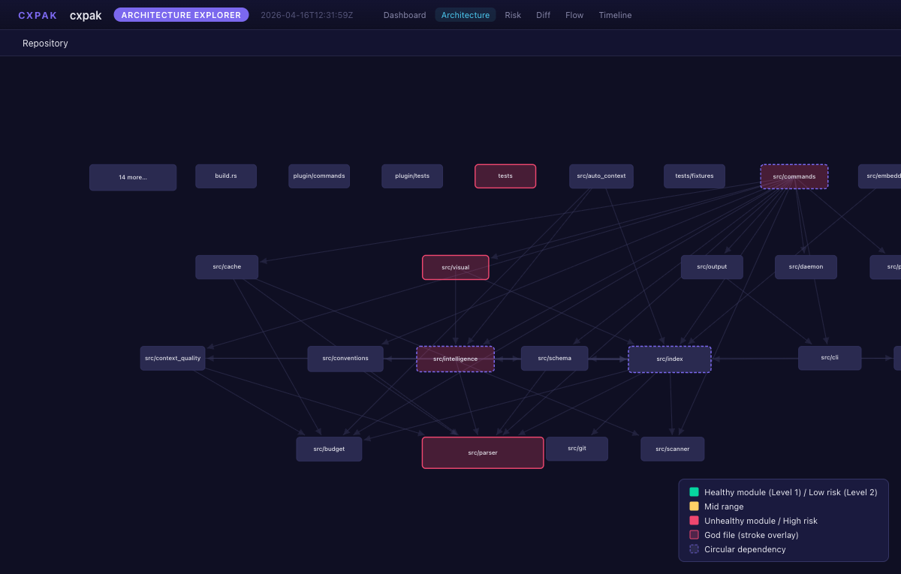
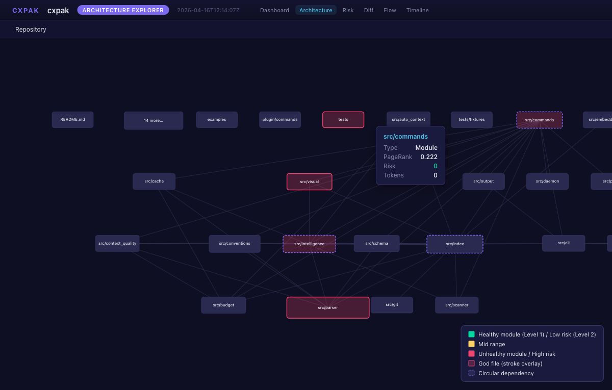
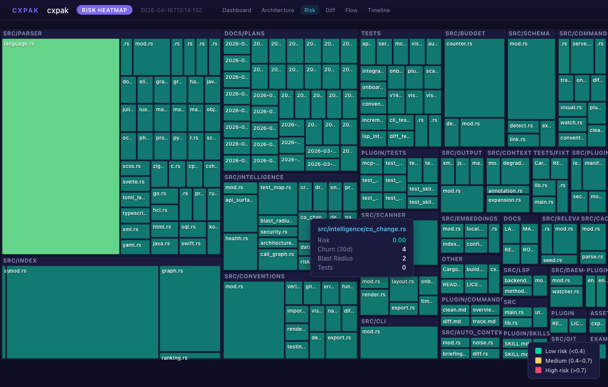
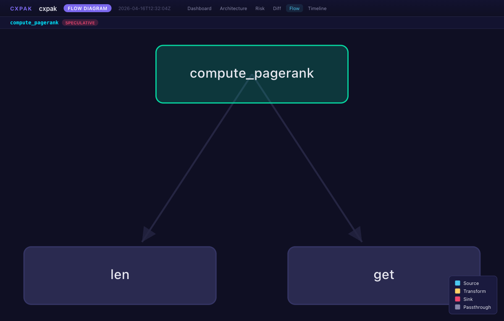
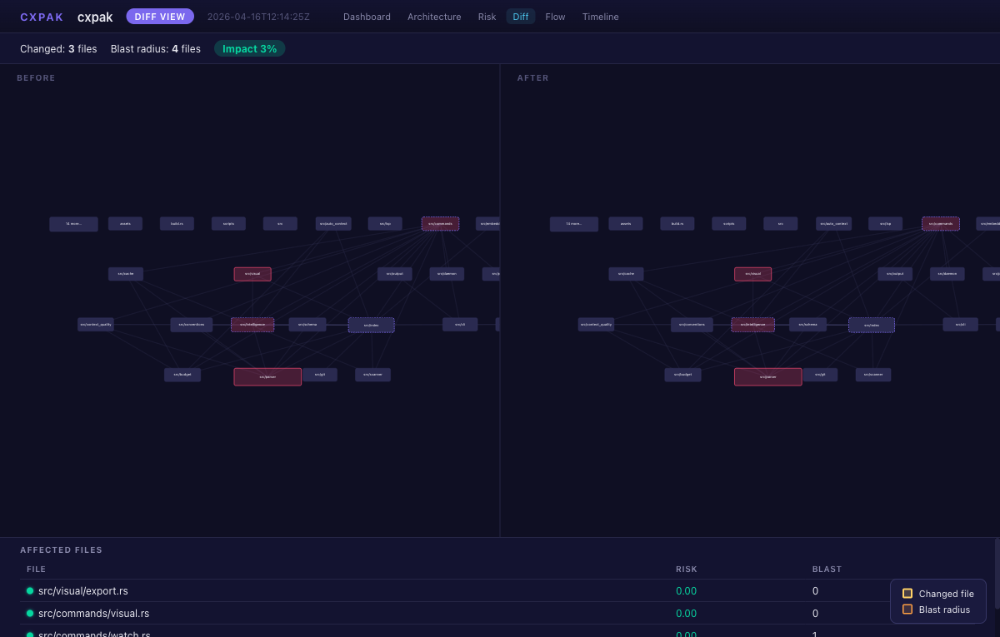

# cxpak


**Spends CPU cycles so you don't spend tokens.**

cxpak indexes your codebase using tree-sitter across 42 languages, builds a typed dependency graph, and produces token-budgeted context bundles that give LLMs a briefing packet instead of a flashlight in a dark room. It understands your code's architecture, conventions, risk profile, and data layer -- then packs exactly what the LLM needs, nothing more.

## What it looks like

<p align="center">

</p>

<details>
<summary>Architecture Explorer -- directed dependency graph with risk coloring</summary>

</details>

<details>
<summary>Architecture -- tooltip with PageRank and metadata on hover</summary>

</details>

<details>
<summary>Risk Heatmap -- treemap sized by token count, colored by risk score</summary>

</details>

<details>
<summary>Flow Diagram -- call graph with directional arrows</summary>

</details>

<details>
<summary>Diff View -- before/after with blast radius overlay</summary>

</details>

## Install

```bash
brew tap Barnett-Studios/tap && brew install cxpak   # macOS/Linux
cargo install cxpak                                   # or via cargo
```

## Quick start

```bash
# See your codebase the way an LLM should
cxpak overview .

# Trace a symbol through the dependency graph
cxpak trace "handle_request" .

# Generate an interactive dashboard
cxpak visual --visual-type dashboard .

# Get a guided reading order for onboarding
cxpak onboard .
```

## Use with AI tools

### Claude Code / Cursor (MCP)

Add to `.mcp.json` in your project root:

```json
{
  "mcpServers": {
    "cxpak": {
      "command": "cxpak",
      "args": ["serve", "--mcp", "."]
    }
  }
}
```

Your AI tool gets 26 codebase intelligence tools -- `cxpak_auto_context` is the main entry point. One call, optimal context:

| Category | Tools |
|----------|-------|
| **Context** | `auto_context`, `overview`, `trace`, `diff`, `search`, `context_for_task`, `pack_context`, `context_diff` |
| **Intelligence** | `health`, `risks`, `architecture`, `blast_radius`, `predict`, `drift`, `dead_code`, `call_graph` |
| **Security** | `security_surface`, `data_flow`, `cross_lang` |
| **Conventions** | `conventions`, `verify`, `briefing` |
| **Visual** | `visual`, `onboard` |
| **Surface** | `api_surface`, `stats` |

### Claude Code Plugin

```
/plugin install cxpak
```

Auto-triggers on architecture questions and change reviews. Slash commands: `/cxpak:overview`, `/cxpak:trace`, `/cxpak:diff`, `/cxpak:clean`.

### HTTP Server

```bash
cxpak serve .                          # port 3000
cxpak serve --token my-secret .        # with Bearer auth on /v1/ endpoints
cxpak watch .                          # file watcher with hot index
```

### LSP

```bash
cxpak lsp .                            # stdio, works with any LSP client
```

CodeLens, hover, diagnostics, workspace symbols, plus 14 custom `cxpak/*` methods. Supports `didOpen`/`didChange`/`didClose` for in-editor reactivity.

## Core capabilities

### Auto Context

`cxpak_auto_context` is the primary entry point. Give it a task and token budget; it returns exactly what the LLM needs.

The pipeline: query expansion with domain-specific synonyms, 7-signal relevance scoring (keyword, symbol, path, domain, import proximity, PageRank, embeddings), seed selection, noise filtering, test/schema/blast-radius enrichment, progressive degradation (Full > Trimmed > Documented > Signature > Stub), and per-file annotations explaining why each file was included.

Every response starts with a Repository DNA section -- a ~1000 token convention summary so the LLM knows how your team writes code before it sees any.

### Intelligence

| Feature | What it does |
|---------|-------------|
| **Health Score** | Composite metric across conventions, test coverage, churn stability, coupling, cycles, dead code |
| **Risk Ranking** | Files ranked by churn x blast radius x test gap -- the ones most likely to cause problems |
| **Architecture** | Per-module coupling, cohesion, circular dependencies, boundary violations, god files |
| **Blast Radius** | Change impact: direct dependents, transitive dependents, test files, schema dependents, each with risk scores |
| **Change Prediction** | Structural + historical (180-day co-change) + call-graph signals, confidence 0.3--0.9 |
| **Architecture Drift** | Compare against stored baselines; auto-saves snapshots for trend tracking |
| **Dead Code** | Symbols with zero callers, ranked by importance (PageRank x visibility) |
| **Call Graph** | Cross-file call edges with Exact/Approximate confidence levels |
| **Security Surface** | Unprotected endpoints, secrets, SQL injection, validation gaps, exposure scores across 12 frameworks |
| **Data Flow** | Trace values source-to-sink through the call graph; reports module/language/security boundary crossings |
| **Cross-Language** | HTTP, FFI, gRPC, GraphQL, shared schema, and exec bridges between languages |

### Visual Intelligence

Six interactive views, self-contained HTML with D3.js. No build step, no CDN.

```bash
cxpak visual --visual-type dashboard .
cxpak visual --visual-type architecture .
cxpak visual --visual-type risk .
cxpak visual --visual-type flow --symbol handle_request .
cxpak visual --visual-type timeline .
cxpak visual --visual-type diff --files "src/api.rs,src/db.rs" .
```

Export formats: HTML, Mermaid, SVG, PNG, C4 DSL, JSON.

Layout engine: Sugiyama method with SCC condensation, barycenter crossing minimization, Brandes-Kopf coordinate assignment, and 7+/-2 cognitive clustering.

### Conventions

Extracts a quantified convention profile from what your team actually does: naming, imports, error handling, dependencies, testing, visibility, function length, git health. Each pattern has counts, percentages, and strength labels (Convention >= 90%, Trend >= 70%, Mixed).

`cxpak_verify` checks code changes against observed conventions -- only flags violations in changed lines. `cxpak conventions export/diff` enables CI drift detection with SHA256 checksums.

### Onboarding

```bash
cxpak onboard .
```

Generates a dependency-ordered reading guide: files topologically sorted, grouped into phases by module, ordered by PageRank. Each file lists key symbols to focus on and an estimated reading time.

## Language support (42)

**Full extraction** (functions, classes, methods, imports, exports):
Rust, TypeScript, JavaScript, Python, Java, Go, C, C++, Ruby, C#, Swift, Kotlin, Bash, PHP, Dart, Scala, Lua, Elixir, Zig, Haskell, Groovy, Objective-C, R, Julia, OCaml, MATLAB

**Structural extraction** (selectors, keys, blocks):
CSS, SCSS, Markdown, JSON, YAML, TOML, Dockerfile, HCL/Terraform, Protobuf, Svelte, Makefile, HTML, GraphQL, XML

**Database DSLs:** SQL, Prisma

## Data layer awareness

cxpak understands your data layer and uses it to build a richer dependency graph:

- **Schema detection** -- SQL DDL, Prisma, Django, SQLAlchemy, TypeORM, ActiveRecord
- **Migration sequences** -- Rails, Alembic, Flyway, Django, Knex, Prisma, Drizzle
- **Embedded SQL linking** -- inline SQL in application code creates edges to table definitions
- **10 typed edge types** -- Import, ForeignKey, ViewReference, EmbeddedSql, OrmModel, MigrationSequence, CrossLanguage, and more

## Embeddings

Semantic similarity as the 7th scoring signal. Local inference with all-MiniLM-L6-v2 (zero config, ~30 MB), or bring your own key for OpenAI, Voyage AI, or Cohere via `.cxpak.json`. Falls back gracefully to 6 deterministic signals on any failure.

## WASM Plugin SDK

Extend cxpak with custom analyzers and detectors:

- Plugin manifest with SHA-256 checksum verification before WASM compilation
- wasmtime sandbox: epoch interruption (CPU), 64 MB memory cap, capability enforcement
- File pattern scoping and content access control

## Workspace support

For monorepos: `--workspace packages/api` scopes scanning to a subdirectory while keeping the full repo as the git root.

## Caching

Parse results cached in `.cxpak/cache/` keyed on file mtime and size. Cache invalidates automatically when tree-sitter grammar versions change. Atomic writes with advisory locking for concurrent process safety. `cxpak clean .` to reset.

## Stable API

v2.0.0 establishes semver for the MCP API. Tool names, parameters, and response structures are stable across 2.x.

## License

MIT

---

Built by [Barnett Studios](https://barnett-studios.com/) -- building products, teams, and systems that last.
